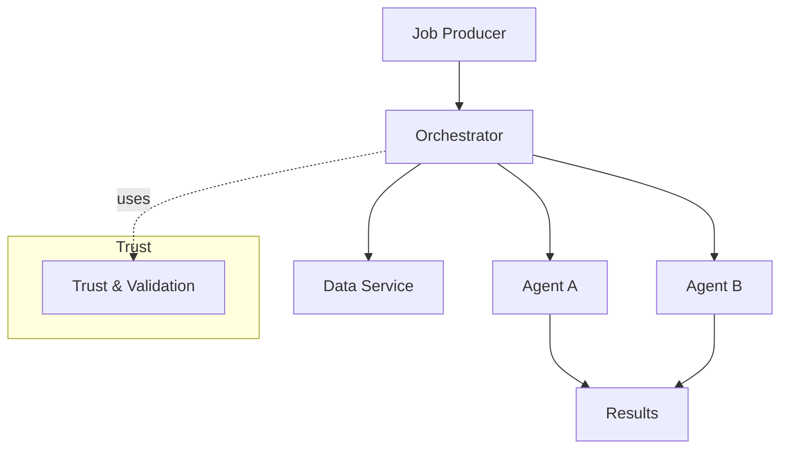

# Architecture Overview

This document describes the **high-level architecture** of the system.

The architecture is designed around a single core assumption:

> **The network is unreliable, heterogeneous, and voluntary — by design.**

A second equally important assumption shapes the scope:

> **The distributed network serves one community-governed AI model/service, not arbitrary user workloads.**

Nodes may appear and disappear at any time, have vastly different hardware capabilities, and cannot be trusted to be always online or always correct. The system embraces these constraints instead of fighting them.

---

## Core Design Principles

These principles are defined with explicit security and failure assumptions in mind.  
For a detailed analysis of adversaries, attack surfaces, and accepted risks, see the
[Threat Model](threat-model).

1. **Decentralization first**  
   No single component is required for the system to function globally.

2. **Failure is normal**  
   Node churn, partial failures, and retries are expected and handled explicitly.

3. **Small, composable units of work**  
   Large jobs are decomposed into many small tasks that can run independently.

4. **Capability-aware scheduling**  
   Tasks are assigned based on what nodes *can* do, not what they *should* do.

5. **Transparency over optimization**  
   Clear behavior and debuggability are preferred over opaque performance gains.
6. **Single-service scope**  
   The compute network is not a general-purpose public infrastructure; scoping reduces the attack surface and simplifies governance and safety.

---

## High-Level Components

The system is composed of five main components:

Each component has a clearly defined responsibility and communicates through explicit interfaces.

---

### See also

- [Compute Agent](/compute-agent)
- [Orchestrator](/orchestrator)
- [Protocol](/protocol)
- [Network Membership & Discovery](/network-membership)
- [Threat Model](/threat-model)
 - [Data Sources & Data Service](/data-sources)

---

## Compute Agent

The **compute agent** is the entry point for participation.

It is a lightweight program, written in **Go**, that runs on volunteer machines and exposes a limited, well-defined set of computational primitives.

### Responsibilities
- Advertise node capabilities (CPU, memory, architecture)
- Execute bounded compute tasks
- Enforce local resource limits
- Report results and execution status
 - Resolve small input/output slices when tasks reference remote data (see [Data Sources](/data-sources))

### Non-Responsibilities
- Global coordination
- Job decomposition
- Trust or validation of other nodes
 - Global data ownership or long-term storage

Agents are intentionally simple and replaceable. Agents may run in two modes of trust: 

- "Untrusted" (permissionless participation) — their results are validated before acceptance.
- "Trusted" (registered) — authenticated and vetted deployments with reduced validation overhead.

See: [Trust & Validation](/trust-and-validation)

---

Related: [Orchestrator](/orchestrator) · [Protocol](/protocol)

## Orchestrator

The **orchestrator** coordinates execution without assuming reliable nodes.

It may exist in multiple instances and does not require global consensus to operate.

### Data-aware coordination
- Accepts jobs with inputs as explicit tensors or as references (URIs/handles)
- Prefers scheduling near data locality to reduce bandwidth
- May stage or materialize frequently used datasets via the [Data Service](/data-sources)
- Applies lightweight validation that only fetches sampled slices from remote data

### Responsibilities
- Decompose large jobs into small tasks
- Match tasks to suitable agents
- Dispatch tasks and track progress
- Retry or reschedule failed tasks
- Collect and assemble results
 - Validate results from untrusted agents with cheaper checks; quarantine agents that fail validation

### Assumptions
- Agents may fail silently
- Results may arrive late or out of order
- Partial results are normal

Trust is a performance hint, not a correctness requirement: untrusted agents are still usable under validation.

The orchestrator treats all agents as ephemeral.

---

Related: [Compute Agent](/compute-agent) · [Protocol](/protocol) · [Network Membership](/network-membership)

## Protocol

All communication between agents and orchestrators uses **gRPC**.

The protocol defines:
- Capability discovery
- Task submission and acknowledgment
- Result reporting
- Heartbeats and liveness signals

### Design Goals
- Explicit versioning
- Backward compatibility
- Minimal surface area

The protocol is intentionally narrow to reduce coupling.

---

Related: [Compute Agent](/compute-agent) · [Orchestrator](/orchestrator)

## Network Membership & Discovery

Nodes must be able to **join and leave the network autonomously**, without relying on a central registry.

### Required Properties
- Decentralized
- Fault-tolerant
- Resistant to single points of failure

### Candidate Mechanisms
- Gossip-based peer discovery
- Distributed hash tables (DHTs)
- Static bootstrap peer lists

The exact mechanism is expected to evolve.

---

Related: [Architecture Overview](/architecture) · [Orchestrator](/orchestrator)

## Execution Model

1. A large job is submitted to an orchestrator
2. The job is split into many small tasks
3. Tasks are matched to agents based on capabilities
4. Agents execute tasks independently
5. Results are collected and reassembled
6. Failed or missing tasks are retried elsewhere

Progress is **eventual**, not synchronous.

---

Related: [Fault Tolerance Model](/architecture#fault-tolerance-model)

## Fault Tolerance Model

The system assumes:
- Nodes can crash or disconnect at any time
- Tasks can fail or be duplicated
- Results may need validation or redundancy

Fault tolerance is achieved through:
- Task retries
- Redundant execution
- Timeouts and heartbeats

Correctness is favored over speed.

---

Related: [Threat Model](/threat-model)

## Relationship to Training & Inference

This architecture is **model-agnostic**.

Training algorithms and inference workloads are layered on top of this execution substrate. The infrastructure does not assume gradient descent, backpropagation, or any specific ML paradigm.

This separation allows algorithmic innovation without infrastructure redesign.

---

Related: [Algorithms](/algorithms) · [Models](/models) · [Roadmap](/roadmap)

## Summary

This architecture is intentionally conservative in assumptions and aggressive in decentralization.

It is designed to scale not by acquiring larger machines, but by **enabling more people to participate**.

The system may be slower than centralized alternatives — but it is open, resilient, and community-owned.