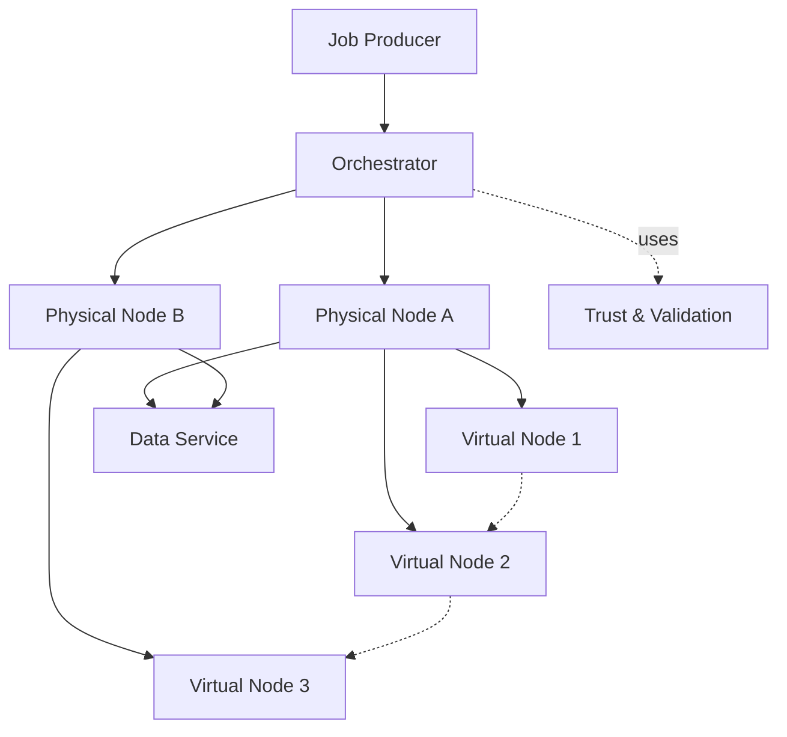

# Architecture Overview

This document describes the **high-level architecture** of the system.

The architecture is designed around a single core assumption:

> **The network is unreliable, heterogeneous, and voluntary — by design.**

A second equally important assumption shapes the scope:

> **The distributed network serves one community-governed AI model/service, not arbitrary user workloads.**

Physical Nodes (PNodes) may appear and disappear at any time, have vastly different hardware capabilities, and cannot be trusted to be always online or always correct. The system embraces these constraints instead of fighting them.

---

## Core Design Principles

These principles are defined with explicit security and failure assumptions in mind.  
For a detailed analysis of adversaries, attack surfaces, and accepted risks, see the
[Threat Model](threat-model).

1. **Decentralization first**  
   No single component is required for the system to function globally.

2. **Failure is normal**  
   Node churn, partial failures, and retries are expected and handled explicitly.

3. **Small, composable units of work**  
   Large jobs are decomposed into many Virtual Nodes (VNodes) that run independently.

4. **Capability-aware allocation**  
   VNodes are assigned to PNodes based on what they *can* do, not what they *should* do.

5. **Transparency over optimization**  
   Clear behavior and debuggability are preferred over opaque performance gains.
6. **Single-service scope**  
   The compute network is not a general-purpose public infrastructure; scoping reduces the attack surface and simplifies governance and safety.

---

## High-Level Components

The system is composed of four main components:

Each component has a clearly defined responsibility and communicates through explicit interfaces.

---

### See also

- [Orchestrator](/orchestrator)
- [Physical Node (PNode)](/pnode)
- [Virtual Node (VNode)](/vnode)
- [Protocol](/protocol)
- [Network Membership & Discovery](/network-membership)
- [Threat Model](/threat-model)
 - [Data Sources & Data Service](/data-sources)

---

## Physical Node (PNode)

The **Physical Node (PNode)** is the entry point for participation.

It is a lightweight program, written in **Go**, that runs on volunteer machines and hosts **Virtual Nodes (VNodes)**.

### Responsibilities
- Auto-registers with the orchestrator on startup
- Advertises node capabilities (CPU, memory, architecture)
- Lazily instantiates VNodes on-demand from network topology
- Manages lifecycle, storage, and network communication for its VNodes
- Enforces local resource limits
- Sends periodic heartbeats to the orchestrator

### Non-Responsibilities
- Global coordination
- Job decomposition
- Trust or validation of other PNodes
 - Global data ownership or long-term storage

PNodes are intentionally simple and replaceable. PNodes may run in two modes of trust: 

- "Untrusted" (permissionless participation) — their results are validated before acceptance.
- "Trusted" (registered) — authenticated and vetted deployments with reduced validation overhead.

See: [Trust & Validation](/trust-and-validation)

---

Related: [Orchestrator](/orchestrator) · [Virtual Node (VNode)](/vnode) · [Protocol](/protocol)

## Virtual Node (VNode)

The **Virtual Node (VNode)** is a stateful agent representing a single neural network component (e.g., a layer, activation function, or loss function).

### Responsibilities
- Execute forward passes independently
- Perform local backward passes using gradient locality
- Communicate with other VNodes via the registry
- Persist and restore state to/from distributed storage (S3/MinIO)

VNodes are allocated to PNodes by the orchestrator but communicate with each other regardless of physical location.

---

Related: [Orchestrator](/orchestrator) · [Physical Node (PNode)](/pnode)

## Orchestrator

The **orchestrator** coordinates execution without assuming reliable nodes.

It may exist in multiple instances and does not require global consensus to operate.

### Data-aware coordination
- Accepts jobs/networks with inputs as explicit tensors or as references (URIs/handles)
- Manages PNode registration and health monitoring
- Handles VNode allocation across PNodes based on availability
- Provides VNode location resolution for distributed communication
- May stage or materialize frequently used datasets via the [Data Service](/data-sources)

### Responsibilities
- Decompose large jobs into Virtual Node graphs
- Match VNodes to suitable PNodes
- Track PNode health and VNode allocation
- Retry or reschedule failed PNodes or VNodes
- Validate results from untrusted PNodes with cheaper checks; quarantine PNodes that fail validation

### Assumptions
- PNodes may fail silently
- Results may arrive late or out of order
- Partial results are normal

Trust is a performance hint, not a correctness requirement: untrusted PNodes are still usable under validation.

The orchestrator treats all PNodes as ephemeral.

---

Related: [Physical Node (PNode)](/pnode) · [Virtual Node (VNode)](/vnode) · [Protocol](/protocol) · [Network Membership](/network-membership)

## Protocol

All communication between PNodes, VNodes, and orchestrators uses **gRPC**.

The protocol defines:
- PNode capability discovery and registration
- VNode allocation and location resolution
- Task submission (Forward/Train) and acknowledgment
- Heartbeats and liveness signals

### Design Goals
- Explicit versioning
- Backward compatibility
- Minimal surface area

The protocol is intentionally narrow to reduce coupling.

---

Related: [Physical Node (PNode)](/pnode) · [Virtual Node (VNode)](/vnode) · [Orchestrator](/orchestrator)

## Network Membership & Discovery

PNodes must be able to **join and leave the network autonomously**, without relying on a central registry.

### Required Properties
- Decentralized
- Fault-tolerant
- Resistant to single points of failure

### Candidate Mechanisms
- Gossip-based peer discovery
- Distributed hash tables (DHTs)
- Static bootstrap peer lists

The exact mechanism is expected to evolve.

---

Related: [Architecture Overview](/architecture) · [Orchestrator](/orchestrator)

## Execution Model

1. A large job/network is submitted to an orchestrator
2. The orchestrator decomposes the job into a graph of VNodes
3. VNodes are allocated to PNodes based on capabilities and availability
4. PNodes instantiate VNodes locally or proxy to remote PNodes
5. VNodes execute forward/backward passes independently using **gradient locality**
6. Failed or missing VNodes/PNodes are retried or relocated

Progress is **eventual**, not synchronous.

---

Related: [Fault Tolerance Model](/architecture#fault-tolerance-model)

## Fault Tolerance Model

The system assumes:
- PNodes can crash or disconnect at any time
- VNodes can fail or be duplicated
- Results may need validation or redundancy

Fault tolerance is achieved through:
- VNode relocation (re-allocation)
- Redundant execution
- Timeouts and heartbeats

Correctness is favored over speed.

---

Related: [Threat Model](/threat-model)

## Relationship to Training & Inference

This architecture is **model-agnostic**, but optimized for **DCNR (Distributed Composable Neural Runtime)**.

Training algorithms and inference workloads are layered on top of this VNode/PNode execution substrate. The infrastructure does not assume a global graph, but rather uses local gradient descent (gradient locality).

This separation allows algorithmic innovation without infrastructure redesign.

---

Related: [Algorithms](/algorithms) · [Models](/models) · [Roadmap](/roadmap)

## Summary

This architecture is intentionally conservative in assumptions and aggressive in decentralization.

It is designed to scale not by acquiring larger machines, but by **enabling more people to participate**.

The system may be slower than centralized alternatives — but it is open, resilient, and community-owned.