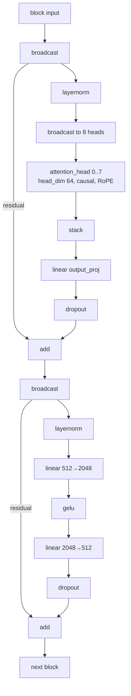

# Production Training Networks

Two transformer topologies are currently used for real training runs on the
network. Both are decoder-only, causal language models defined entirely in
[network YAML](/network-definition) — the full files are in the
[`compute-all/data`](https://github.com/Free-LLM/compute-all/tree/main/data)
directory.

They share the same building blocks:

- **Token embedding** (`embedder`) with the embedding matrix published as
  `token_embedding` and **tied to the LM head**.
- **Pre-norm transformer blocks** with **distributed attention**: each block
  broadcasts to **8 independent `attention_head` VNodes** (head dim 64,
  causal, **RoPE** position encoding, θ = 10000), stacks the head outputs,
  and applies an output projection — so every head can be placed on a
  different PNode. At runtime the orchestrator's
  [fusion pass](/network-definition#optimization-passes) rewrites each of
  these head groups into a single multi-head VNode, batching GPU dispatches
  across all eight heads.
- A **GeLU feed-forward block** (512 → 2048 → 512) with residual
  connections and dropout.
- A **SwiGLU LM head**: final layer norm, up-projection 512 → 4096, SwiGLU
  gate (4096 → 2048), down-projection 2048 → 512, then the tied `lm_head`
  linear producing vocabulary logits.
- **`ce_logits` cross-entropy cost** computed in float32 for numerical
  stability, while the network itself runs in **fp16** (network-wide
  `precision: fp16`, with fp32 master weights in the optimizers). The tied
  `lm_head` and this cost node are fused into a single `tied_lm_head_ce`
  VNode at training time, so the full `[batch, seq, vocab]` logits tensor is
  never materialized.
- **Adam** as the per-node optimizer, with the learning rate exposed as a
  training metric.

One transformer block looks like this:

---

## Topology 1 — 6 layers, 10K vocab, 128 context

`distributed_attention_example_6_swiglu_head.yml`
(`distributed-multi-head-attention-6l-swiglu_ffn`)

| Property | Value |
|----------|-------|
| Transformer blocks | 6 (8 attention heads each — 48 distributed heads) |
| Model dimension | 512 (head dim 64) |
| Context length | 128 tokens |
| Vocabulary | 10,000 BPE tokens |
| FFN | GeLU, 512 → 2048 → 512 |
| LM head | SwiGLU (512 → 4096 → 2048 → 512), tied embeddings |
| Precision | fp16 (fp32 loss and master weights) |
| Graph size | 143 VNodes |
| Parameters | ≈ 27M (with tied embeddings) |

This is the **smaller iteration/testbed network**: fast steps, quick
end-to-end experiments on tokenizer, dataset, and training-loop changes.

## Topology 2 — 8 layers, 32K vocab, 512 context

`distributed_attention_example_8_swiglu_head_vocab32768_seq512.yml`
(`distributed-multi-head-attention-8l-swiglu_ffn`)

| Property | Value |
|----------|-------|
| Transformer blocks | 8 (8 attention heads each — 64 distributed heads) |
| Model dimension | 512 (head dim 64) |
| Context length | 512 tokens |
| Vocabulary | 32,768 BPE tokens |
| FFN | GeLU, 512 → 2048 → 512 |
| LM head | SwiGLU (512 → 4096 → 2048 → 512), tied embeddings |
| Precision | fp16 (fp32 loss and master weights) |
| Graph size | 183 VNodes |
| Parameters | ≈ 45M (with tied embeddings) |

This is the **current production training network** — the workload that
drove the runtime optimization effort (FlashAttention-2-style tiled
attention, fused LM-head cross-entropy, attention-head fusion). On a single
Apple M3 Max PNode its average step time came down from ~240 s to
**~100 s** over successive rounds; see
[training performance](/status#training-performance) for the breakdown. On
NVIDIA hardware, a single `g4dn.xlarge` (Tesla T4) handles this fixture up
to batch size 32.

---

## Placement

Every node in a block carries `colocate_group: transformer_block_N` with
`colocate_policy: required`, and the embedding/LM-head group is colocated as
`token_embedding` — so the orchestrator keeps each block together on one
PNode (minimizing cross-node traffic within a block) while different blocks
can be spread across the fleet, giving pipeline-style distribution with
per-head parallelism available when more PNodes are present.

## See also

- [Network Definition (YAML)](/network-definition)
- [Virtual Node (VNode) & Node Types](/vnode)
- [Project Status](/status)
